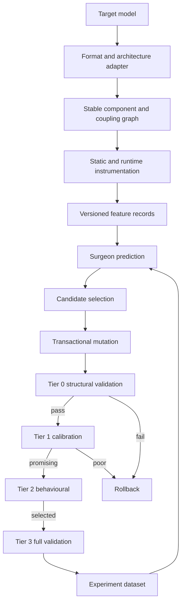
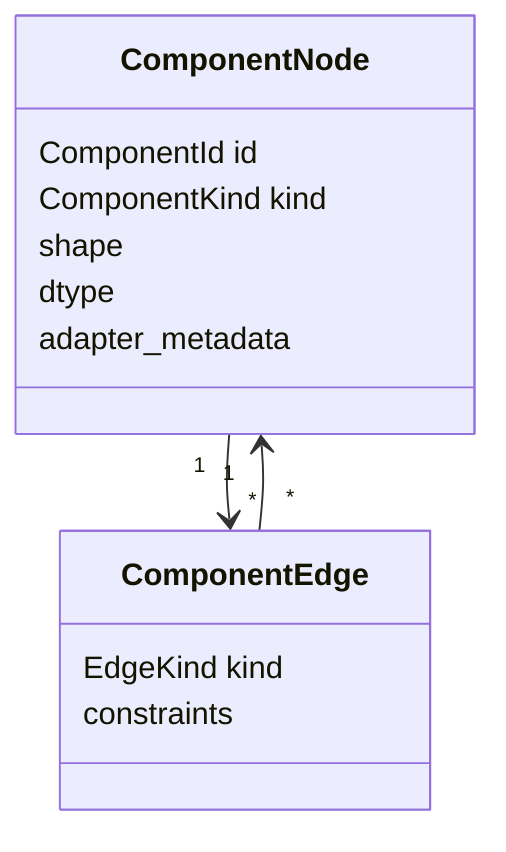
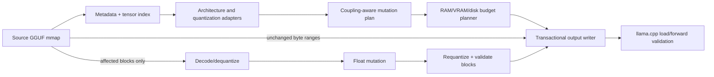
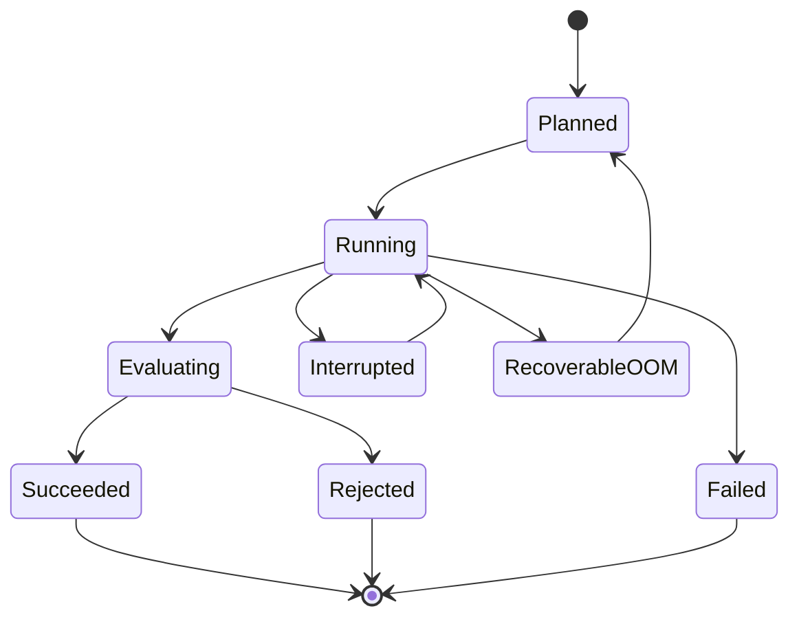

# ModelSurgeon Architecture

## Purpose and boundaries

ModelSurgeon learns to predict the consequences of neural-network structural changes, executes controlled mutations, evaluates them, and searches for smaller or faster models under explicit quality constraints. It is not a generic training framework, benchmark suite, model hub, or wrapper around a single pruning method.

Two paths are equally fundamental:

```text
HIGH-PRECISION PATH                     LOW-HARDWARE PATH
HF/safetensors                          existing quantized GGUF
      |                                        |
inspect + instrument                    mmap + inspect in place
      |                                        |
structural surgery                      selective dequantize
      |                                        |
new checkpoint                          mutate + requantize
      |                                        |
optional quantization                   streaming new GGUF
```

The low-hardware path never requires a complete floating-point model in RAM or on disk for ordinary surgery. Unknown GGUF architectures and unsupported quantization layouts fail closed.

## End-to-end pipeline



## Conversational control plane (v2.7 stateful campaigns closed; product planned for v2.8–v3.0)

The repository currently exposes structured ModelSurgeon APIs and CLI workflows. The v2.0 autonomous optimizer release boundary freezes the evidence, compatibility, and claim policy; the bounded v2.1 intent-record, compiler, policy, and corpus contracts, v2.2 replaceable-provider boundary, v2.6 typed tool boundary, and the **closed v2.7 stateful campaign boundary** are implemented and frozen. The conversational product remains planned; the tool boundary and state store are not a general agent runtime or an alternate execution authority. See the [v2.0 release audit](docs/release/v2.0-autonomous-optimizer-audit.md), [v2.2 release boundary](docs/release/v2.2-provider-layer-boundary.md), [v2.6 release boundary](docs/release/v2.6-bounded-conversational-tool-boundary.md), the [v2.7 release boundary](docs/release/v2.7-stateful-campaigns-boundary.md), and [canonical campaign state design](docs/design/conversational-campaign-state.md).

```text
User request
    ↓
Text LLM / conversational harness
    ↓  (typed, bounded request)
validated OptimizationSpec
    ↓
ModelSurgeon deterministic execution engine
    ↕
learned Meta-Surgeon predictions (never acceptance authority)
    ↓
canonical measured evidence and deployable artifacts
    ↓
Text LLM explanation with evidence references
    ↓
User
```

The planned boundary has four non-negotiable properties:

- The text LLM interprets intent, asks necessary questions, requests allowlisted operations and explains results. It does not select tensors, override hard constraints, fabricate measurements or promote an unvalidated artifact.
- `OptimizationSpec`, campaign state, approval state and evidence records are structured ModelSurgeon state. Chat history and provider output are not authoritative state.
- The deterministic engine owns model/hardware inspection, capability checks, candidate generation, mutation, rollback, evaluation, budgets, acceptance, artifact publication and provenance. The learned Meta-Surgeon can rank or predict within those policies, but its predictions are not measurements.
- Consequential calls pass through typed capabilities, transaction boundaries, existing approval gates and fail-closed validation. Provider secrets and untrusted text/metadata/tool output remain outside trusted evidence fields.
- The v2.3 vertical slice keeps the optimizer's JSON stage cursor separate from the #469 WAL-backed campaign record. Accepted, rejected, unsupported, failed, paused, cancelled and no-artifact outcomes retain canonical engine evidence; only an accepted immutable digest can cross the artifact boundary.

The v2.1–v3.0 work is staged: v2.1 freezes the intent compiler contract; v2.2 adds replaceable providers; v2.3 adds the first chat vertical slice; v2.4 freezes bounded clarification; v2.5 closes explicit negotiation; v2.6 freezes the typed tool boundary; **v2.7 closes canonical campaign state and bounded recovery**; v2.8 adds evidence-grounded explanations; v2.9 hardens approvals and security with the versioned [adversarial resistance corpus](docs/testing/adversarial-resistance.md); v3.0 integrates the product. Direct CLI/Python callers bypass the conversational layer and remain supported. A frozen boundary does not imply availability of later product layers or live external evidence.

The v2.7 recovery guarantee is tested by a bounded fixture matrix, not by a
successful UI reconnect. Recovery compares canonical state, evidence cursors,
retained artifacts, actions, budgets, provenance, hard constraints and source
identity through both direct/store and summary/chat paths. Atomic fault
checkpoints and a separate-process reopen are included; hostile-process
containment and UI correctness remain outside the claim.

The v2.7 release guarantee is local and bounded: one owning store instance per
campaign, with a process-local lock and SQLite WAL durability across the tested
reopen boundary. Multi-writer concurrency, distributed coordination or
cross-host recovery are unsupported release guarantees. The boundary composes
with #415 progress resumability, #427 autonomous orchestration and #428
approval/reproducibility packages without replacing their authorities.

### v2.5 negotiation decision-quality boundary

The v2.5 control plane replays typed fixture campaigns through refusal-only,
measured-Pareto, and prediction-only policies. Only canonical measured
evidence can populate a Pareto alternative; a prediction-only result is
retained as a negative control and is never shippable. A constraint change
requires the immutable proposal, v2.0-scoped approval, application, new
campaign identity, and preserved evidence archive from the objective-amendment
API. The bounded study retains failed, unsupported, unknown, predicted-only,
and inconclusive cells and stops on any silent hard-constraint change. The
milestone-level decision and duplicate-scope review are frozen in the [v2.5
release boundary](docs/release/v2.5-constraint-negotiation-boundary.md) and
[machine-readable evidence manifest](docs/research/v2.5-constraint-negotiation-release-v1.json).

### v2.4 clarification boundary

The v2.4 layer is a deterministic control-plane state machine around the
existing `IntentRecord` and `IntentPolicyDecision`; it is not a second
objective schema or an alternate surgery authority. It asks only for a
necessary executable field, required ambiguity, low-confidence required field,
or explicit soft-preference ordering. Refused contradictions and unsupported
fields do not receive questions. Typed answers create derived intents with
clarification provenance and are recompiled through the same fail-closed policy
before an `OptimizationSpec` can appear.

State, question, answer, transition, policy, study-result, and run identities
are derived from canonical JSON. Replay re-evaluates the root intent and answer
sequence and rejects altered policy or state. Hard constraints, source-model
immutability, deterministic IDs/provenance, engine-owned resource budgets,
measurement, acceptance, rollback, and publication remain outside the
clarification layer. The supported language and metric cells, bounded study
limits, known skips, and non-claims are frozen in the
[v2.4 release boundary](docs/release/v2.4-clarification-boundary.md).

The request-version-1/result-version-2 tool boundary and trusted dispatcher are documented in
[`docs/design/conversational-tool-schemas.md`](docs/design/conversational-tool-schemas.md).
It is a finite allowlist and fail-closed pre-execution and dispatch contract;
it does not add arbitrary command execution or direct tensor-removal authority
to the text model. Provider/tool trust zones, secret handling, and the explicit
process-isolation limitation are documented in
[`docs/design/provider-tool-isolation.md`](docs/design/provider-tool-isolation.md).

## Package architecture

| Package | Responsibility |
|---|---|
| `adapters` | HF, safetensors, GGUF, architecture-family and quantization boundaries |
| `graph` | stable component IDs, discovery, topology, coupling and mutation constraints |
| `features` | versioned static, spectral, activation, gradient, redundancy and runtime records |
| `instrumentation` | calibration data, hook lifecycle and bounded aggregation |
| `surgery` | mutation contract, masks, physical edits, provenance and rollback |
| `evaluation` | tiered structural, perplexity, behavioural, latency and resource metrics |
| `experiments` | definitions, state machine, persistence, cache, budgets and resumability |
| `datasets` | mutation examples, schemas, validation and leakage-safe splits |
| `surgeon` | heuristics, linear/tree/MLP models, calibration, uncertainty and inference |
| `search` | candidates, active learning, constraints, objectives and sequential policies |
| `explain` | attribution, decision summaries and reports |
| `cli` | user workflows; business logic remains in packages above |

Adapters expose canonical capabilities rather than leaking library-specific objects. Feature extractors and mutations consume component graph nodes. Storage schemas contain canonical IDs and versioned records, never live framework objects.

## Component identity and graph

A component ID is a validated, immutable sequence of typed path segments. Examples include `model.layers.17.self_attn.head.4` and `model.layers.12.mlp.up_proj.channel.1830`. IDs remain stable across instrumentation, mutation, evaluation, datasets, predictions and reports. Physical surgery emits an explicit old-to-new identity mapping; it never silently reinterprets an ID after indices shift.



Edges express `parent`, `child`, `consumes`, `produces`, `coupled-with`, and `constrained-by`. A mutation plan is valid only when the adapter resolves every affected node, its coupled closure, axis semantics, and shape/quantization constraints.

## Native GGUF surgery

GGUF is a first-class analysis and physical-surgery format. The subsystem separates container I/O, architecture mapping, tensor layout, quantization codecs, mutation planning and validation.



The writer uses copy-on-surgery: untouched tensors are copied byte-for-byte when container alignment permits; changed tensors alone are decoded, mutated, encoded and written. It preflights free disk space, writes to a staging path, checkpoints completed ranges, verifies checksums/metadata, and atomically publishes the destination. Interrupted output remains resumable or safely removable; the source is immutable.

Memory modes are `full`, `tensor`, and `streaming`. Each operation declares a peak-memory estimate and a scratch-space estimate. The planner respects configurable RAM and VRAM ceilings, supports CPU-only execution and disk-backed intermediates, and may shrink chunk size after an OOM. A 20–40 GB GGUF remains memory-mapped rather than resident.

Quantization is represented by a codec interface with exact block shape, packing, alignment, decode, encode and validation behavior. F32/F16/BF16, Q8_0, Q6_K, Q5_K, Q4_K, Q3_K, Q2_K and IQ families are separate capabilities; no K-quant is inferred from another. Initial production priority is Q8_0, Q6_K, Q5_K_M and Q4_K_M. Implementations track the llama.cpp specification revision they match and use conformance vectors.

Physical GGUF mutations resolve model-family rules for Llama, Qwen, Mistral and Gemma. MLP channel removal closes over gate/up/down tensors; attention head removal closes over Q/K/V/O and accounts for GQA/MQA/KV counts; layer removal updates tensors, names and metadata; low-rank replacement touches only selected tensors. Hidden-dimension surgery remains gated behind a bounded feasibility study because it couples most of a model.

## Feature and provenance model

Each `FeatureRecord` identifies the model revision, component, extractor/schema versions, value, aggregation, sample set and precision provenance. Quantized features record codec, bits per weight, direct-versus-locally-dequantized source, sampled blocks and estimated error. This allows the surgeon to learn different uncertainty for BF16 and Q4-derived measurements.

Large activations are reduced online into mergeable statistics. Raw tensors are opt-in, bounded, disk-backed and content-addressed. GPU tensors are released at extractor boundaries.

## Experiment lifecycle and storage

SQLite stores normalized metadata and state; Parquet stores tabular feature/example partitions; content-addressed filesystem artifacts store tensors, checkpoints and reports.



Deterministic experiment IDs derive from canonical configuration and immutable input revisions. Atomic state transitions, leases, completion detection and idempotent artifact publication make campaigns reboot-safe. Records capture model/dataset revisions, git commit, lock digest, seeds, hardware/software inventory, baseline/post metrics, deltas and timings.

For native quantized surgery, every experiment can include a matched requantization control: decode and re-encode the affected region without surgery. Evaluation reports separate baseline quantization loss, surgery loss and their interaction.

Canonical evidence queries also provide a deterministic negative-evidence
explanation projection. It joins allowlisted mutation, evaluation and rollback
records, preserves metric direction/unit/threshold/uncertainty and full
lineage, and emits explicit incomplete/unknown fields. Unsupported is not
failed, unknown is not rejected, and rollback is never an acceptance claim.

## Surgeon training and active learning

The model ladder is heuristic, linear/logistic, LightGBM/XGBoost, small MLP, then set/sequence/GNN/transformer only if validation shows simpler models saturate. Targets include delta loss/perplexity/behaviour/latency/parameters and probability of satisfying a constraint. Quantization, feature precision, estimated quantization error and hardware are input features.

Leakage-safe splitters group by component, layer, mutation, model and architecture family. Cross-model claims require completely held-out models. Active learning combines calibrated uncertainty, predicted utility and diversity under explicit experiment and hardware budgets; it deduplicates canonical candidate descriptions and records selection propensity.

## Search and repair

Objectives are user-defined combinations of quality, parameter, latency, memory and disk costs with hard constraints. Search operates on graph-valid mutation plans, evaluates short sequences transactionally, and may apply LoRA repair, short fine-tuning or distillation as separately budgeted operations. A Pareto archive prevents one hard-coded reward from defining all workflows.

## Hardware, reproducibility and safety

- Primary baseline: RTX 3060 12 GB, i5-14600K, 64 GB RAM, Windows 11/WSL2.
- All substantial loops are batched, bounded, cached and resumable.
- OOM is classified and retried with smaller batches/chunks or CPU offload.
- Original checkpoints are read-only by default; destinations must differ and publish atomically.
- Remote model code is opt-in and recorded.
- `modelsurgeon reproduce RUN_ID` reconstructs config, revisions, seed, environment and commands.
- Optimize approvals bind to a canonical plan digest, material plan diff,
  operator identity/context, and expiry; a changed plan requires a new diff and
  decision. Persisted optimize evidence can be replayed without model
  execution, and final runs can be emitted as signed, offline-verifiable
  packages that retain unavailable external inputs and non-deterministic
  tolerances.
- GPU CI is optional and scheduled; PR CI uses tiny CPU fixtures.

## Architectural decisions

ADRs under `docs/design/` record stable IDs, local-first storage, progressive surgeon complexity, tiered evaluation, transactional mutation and native copy-on-surgery GGUF design.

