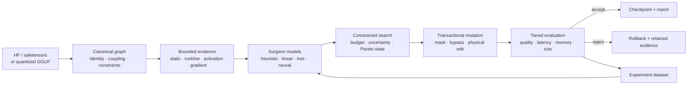

<div align="center">

# ModelSurgeon

### Learn what a neural network can lose — and measure what it costs.

[](https://github.com/xdCloudy/ModelSurgeon/actions/workflows/ci.yml)
[](https://www.python.org/)
[](https://github.com/xdCloudy/ModelSurgeon/milestones)
[](LICENSE)

**Local-first, evidence-driven structural optimization for Hugging Face and GGUF models.**

[Get started](#quick-start) · [See what works](#project-status) · [Use the CLI](#cli-workflows) · [Read the end-to-end guides](docs/user-guides/README.md) · [Read the architecture](ARCHITECTURE.md) · [Follow the roadmap](ROADMAP.md)

</div>

ModelSurgeon is experimental research software for learning which parts of a neural network can be removed, measuring the result, and preserving enough evidence to reproduce every decision. It combines canonical model structure, bounded feature collection, reversible experiments, learned surgeon models, constrained search, and transactional physical mutation.

It supports two complementary paths:

- **Hugging Face / safetensors** for inspection, calibration, masking experiments, learned outcome models, search, and physical tensor surgery.
- **Native GGUF** for bounded, copy-on-surgery edits to quantized models without materializing a full floating-point checkpoint.

> [!WARNING]
> ModelSurgeon is pre-alpha research software, not a production optimizer. Surgery can damage model quality or produce unusable checkpoints. Inputs are treated as immutable, outputs are staged separately, and unsupported layouts fail closed.

The v2.1 conversational intent boundary, v2.2 replaceable-provider boundary,
v2.6 bounded tool boundary, and v2.7 canonical campaign state store are frozen around the existing `OptimizationSpec`
contract. The tool boundary is control-plane infrastructure, not a general
agent runtime, `modelsurgeon chat` product release, universal hosted-provider
claim, or optimization evidence. ModelSurgeon retains authority over
constraints, surgery, validation and artifact publication. The state store
persists campaign linkage, spec/constraint identity, approvals, budgets,
provider context, lifecycle and retained evidence without persisting chat
transcripts. See the [v2.6
release boundary](docs/release/v2.6-bounded-conversational-tool-boundary.md)
and [canonical campaign state design](docs/design/conversational-campaign-state.md).
Direct CLI/Python workflows remain the supported automation path.

## Why ModelSurgeon?

| Principle | What it means in practice |
| --- | --- |
| **Evidence over intuition** | Static, activation, gradient, quality, latency, memory, and hardware evidence travel with each result. |
| **Learn from experiments** | Mutation outcomes become leakage-audited data for heuristic, linear, tree, and neural surgeon models. |
| **Reversible before destructive** | Mask, bypass, evaluate, and roll back before publishing a physically modified artifact. |
| **Quantized models are first-class** | GGUF edits selectively decode affected blocks and copy untouched encoded ranges byte-for-byte. |
| **Consumer hardware matters** | Work is bounded, streamed, resumable, and tested around a 12 GB GPU / 64 GB RAM workstation. |

## Project status

Current package version: **`1.0.0` (evidence-bounded research release)**. The v0.5–v0.9 research path and the v1.0 release boundary have reproducible repository evidence; production-wide support is not implied.

The v2.0 autonomous benchmark boundary is implemented as a preregistration
and publication gate. It requires exact checkpoints, held-out splits, equal
budgets, repeated confidence-bounded measurements, complete artifact lineage,
and an independent audit/replay before any competitiveness claim can publish.
The repository does not claim live v2 benchmark results; see the [v2.0
benchmark status](docs/research/v2.0-autonomous-benchmark.md).
The release-facing capability matrix, scientific limitations, and reproduction
policy are in the [v2.0 release audit](docs/release/v2.0-autonomous-optimizer-audit.md)
and [scientific report](docs/research/v2.0-autonomous-optimizer-report.md).

| Area | State | Current capability |
| --- | --- | --- |
| Inspection and component graph | **Implemented** | HF loading, revision provenance, architecture detection, stable component IDs, coupling, and mutation constraints. |
| Instrumentation and evaluation | **Implemented** | Static, spectral, activation, gradient, redundancy, perplexity, latency, memory, and runtime telemetry. |
| Mutation lab and datasets | **Implemented** | Transactional masks/bypasses, rollback, tiered evaluation, resumable campaigns, grouped splits, and leakage audits. |
| Learned surgeons | **Validated baseline** | Heuristic, linear/logistic, LightGBM, and MLP bundles with held-out evidence and honest negative results. |
| Active learning and search | **Experimental** | Calibrated uncertainty, bounded candidate pools, acquisition policies, resumable scheduling, Pareto archives, and repair arms. |
| Physical HF surgery | **Experimental** | Layer, attention-head, gated-MLP, and low-rank edits with shape, parameter, save, and reload checks. |
| Native GGUF surgery | **Experimental** | Exact codecs, MLP/head/layer/low-rank edits, streaming output, requantization controls, and `llama.cpp` validation. |
| Public/release surface | **Evidence-bounded** | v1.0 schemas, CLI workflows, reports, performance gates, security hardening, and release documentation. |
| Conversational control plane | **v2.3 chat execution slice experimental** | `modelsurgeon chat` bootstraps a bounded local GGUF control-plane provider, validates typed objectives, and can submit confirmed specs through the stable optimize planner/orchestrator with typed progress, canonical campaign evidence, resumable interruption, and retained negative outcomes. Universal hosted support and live provider benchmarks remain outside this slice. |
| Conversational tool boundary | **v2.6 bounded tool boundary** | Four allowlisted, capability-scoped tools with strict schemas, budgets, approval/transaction gates, grounded result envelopes, deterministic replay, and adversarial fixture evidence. General agent execution, live providers, campaign execution, and hostile-process containment remain unsupported or unclaimed. |
| Conversational campaign state | **v2.7 canonical state implemented** | WAL-backed restart/reconnect store with deterministic versioned transitions, spec/approval invalidation, optimistic stale-context checks, provider/resource context, and append-only supported/unsupported/failed/unknown/inconclusive evidence. Chat transcripts are not authoritative. |
| Conversational summaries | **v2.7 bounded non-authoritative view** | Deterministic, budgeted transcript summaries keep canonical state/evidence separate, mark omissions and unsupported roles, preserve negative evidence, and refuse stale or over-budget rehydration. |
| Clarification and ambiguity handling | **v2.4 bounded milestone closed** | Necessary-only typed questions, fail-closed contradiction handling, explicit soft-preference selection, deterministic replay/provenance, and retained negative/inconclusive evidence. General natural-language understanding and autonomous negotiation are not claimed. See the [v2.4 release boundary](docs/release/v2.4-clarification-boundary.md). |
| Measurable target elicitation | **v2.4 bounded clarification** | Vague quality, latency, throughput, memory, and deployment requests receive targeted measurable questions; complete specs proceed, while unsupported metrics remain explicit and no thresholds or baselines are invented. The [clarification measurement protocol](docs/design/clarification-measurement.md) retains bounded safety evidence. |

Measured evidence currently includes:

- a leakage-free **3,000-mutation First Surgeon** campaign on SmolLM2-135M;
- active-learning, uncertainty, transfer, pruning-baseline, and iterative-search studies;
- real HF and native-GGUF physical mutation and repair runs; and
- a **134.5M–7.25B** consumer-hardware ladder on Windows with an RTX 3060 12 GB and 64 GB RAM.

The results include negative findings where a learned policy or repair did not beat the declared baseline. Start with the [v1.0 scientific results and limitations](docs/research/v1.0-scientific-results.md), [research index](docs/research/README.md), [First Surgeon evidence](docs/research/v0.5-first-surgeon-evidence.md), and [consumer scale evidence](docs/research/v0.8-consumer-scale-evidence.md).

## Quick start

### Requirements

- Python **3.12+**
- [`uv`](https://docs.astral.sh/uv/)
- optional CUDA-capable PyTorch environment for GPU workflows
- optional external `llama.cpp` tools for native GGUF validation and benchmarking

```bash
git clone https://github.com/xdCloudy/ModelSurgeon.git
cd ModelSurgeon
uv sync --extra dev --extra hf --locked
uv run modelsurgeon --help
```

Inspect a Hugging Face causal language model without mutating it:

```bash
uv run modelsurgeon inspect HuggingFaceTB/SmolLM2-135M \
  --device-map cpu \
  --dtype auto
```

Add `--json` for machine-readable model and component records.

The direct optimize workflow does not require a text model or conversational
dependency. Use the explicit no-LLM mode in automation when desired:

```bash
uv run modelsurgeon optimize \
  --model models/tiny-supported \
  --revision sha256:replace-with-an-immutable-revision \
  --no-llm --json
```

Provider selection is optional and fail-closed. Inspect the resolved provider
configuration without starting a model with
`uv run modelsurgeon provider diagnostics --json`; see the
[configuration contract](docs/design/configuration.md) for precedence,
redaction, and supported/unavailable outcomes.

## CLI workflows

The public CLI exposes the stable orchestration boundary. Lower-level HF and GGUF surgery APIs remain library-level while their end-user contracts are stabilized for v1.0.

| Command | Purpose |
| --- | --- |
| `inspect` | Load and enumerate a Hugging Face causal language model. |
| `chat` | Start an experimental bounded chat session around a local GGUF text model; optionally preview or execute a confirmed stable optimize plan. |
| `experiment` | Resolve, evaluate, and roll back one transactional mutation. |
| `first-surgeon-proof` | Build a leakage-safe proof dataset through a runtime adapter. |
| `first-surgeon-hf-proof` | Run real HF MLP-channel masks and create the proof dataset. |
| `first-surgeon-evidence` | Train proof LightGBMs and publish held-out baseline comparisons. |
| `train-surgeon` | Train and publish an immutable baseline surgeon bundle. |
| `predict-surgeon` | Score compatible candidates with a persisted bundle. |
| `search` | Start or resume one constrained greedy, beam, or uncertainty-aware search decision. |
| `features` | Extract bounded, cacheable model features through a trusted runtime. |
| `calibrate` | Build or reuse a revision-pinned, content-addressed calibration manifest ([contract](docs/design/calibration-cli.md)). |
| `generate-dataset` | Run or resume a campaign and emit leakage-safe JSONL splits. |
| `optimize` | Plan or execute a bounded, resumable autonomous optimization workflow. |
| `reproduce` | Verify and optionally replay an immutable persisted experiment recipe. |
| `report` | Render deterministic JSON or offline HTML evidence reports. |

Global logging is available through `--log-level` and `--log-format human|json`. Run any command with `--help` for its complete contract. Generate shell-specific completion instructions with `modelsurgeon --show-completion`; use `--install-completion` only when you intend to modify the current user's shell configuration.

<details>
<summary><strong>Run the First Surgeon workflow</strong></summary>

Generate real MLP-channel mutation examples:

```bash
uv run modelsurgeon first-surgeon-hf-proof \
  HuggingFaceTB/SmolLM2-135M ./calibration.txt \
  --output ./proof-data \
  --max-candidates 3000 \
  --sequence-length 32 \
  --max-tokens 64 \
  --safe-perplexity-delta 0 \
  --seed 42 \
  --split-seed 43 \
  --tool-revision "$(git rev-parse HEAD)"
```

Train and compare the held-out LightGBM models:

```bash
uv pip install "lightgbm>=4,<5"
uv run modelsurgeon first-surgeon-evidence ./proof-data/examples.jsonl \
  --split ./proof-data/split.json \
  --registry ./proof-data/registry \
  --output ./proof-data/evidence.json \
  --safe-perplexity-delta 0 \
  --threads 4 \
  --seed 42 \
  --top-n 50 \
  --bootstrap-repetitions 1000
```

The campaign refuses to publish when a split is empty or the leakage audit finds contamination. See the [proof protocol](docs/first-surgeon-proof.md) and [evidence contract](docs/first-surgeon-evidence.md).

</details>

<details>
<summary><strong>Amend an objective explicitly</strong></summary>

Measured infeasibility never changes a contract by itself. Build an immutable
objective amendment from the original contract and #458 feasibility evidence,
approve the exact visible diff, and apply it only against the unchanged
original objective:

```python
from modelsurgeon.search import (
    apply_objective_amendment,
    approve_objective_amendment,
    propose_objective_amendment,
)

proposal = propose_objective_amendment(
    original_contract,
    proposed_contract,
    rationale="measured near-miss evidence supports this explicit trade-off",
    evidence=feasibility_explanation,
    operator_id="operator-alice",
    requested_at="2026-09-07T10:00:00+00:00",
    expires_at="2026-09-07T11:00:00+00:00",
)
approved = approve_objective_amendment(
    proposal, operator_id="operator-alice", decided_at="2026-09-07T10:05:00+00:00"
)
application = apply_objective_amendment(
    approved,
    current_objective=original_contract,
    applied_at="2026-09-07T10:06:00+00:00",
)
```

The proposal contains the original objective, proposed amendment, rationale,
approval scope/provenance, deterministic materiality diff, and retained
evidence IDs. A material amendment receives a new spec/campaign identity;
reordering or a no-op remains non-material. Rejection, expiry, cancellation,
stale replay, and immutable history are exposed through the same direct API.
See [the amendment design](docs/design/objective-amendments.md) and the
[tiny fixture example](docs/examples/objective_amendment.py).

</details>

<details>
<summary><strong>Run the bounded autonomous optimizer</strong></summary>

Execution requires a trusted runtime adapter and explicit approvals. The adapter
owns model-specific profiling, mutation, evaluation, repair, quantization, and
deployment measurement; the orchestrator owns state, budgets, lineage, and
promotion safety.

```bash
uv run modelsurgeon optimize \
  --model HuggingFaceTB/SmolLM2-135M \
  --revision <immutable-revision> \
  --preset balanced \
  --hardware-profile cpu-small \
  --execute \
  --state artifacts/optimize/run.json \
  --runtime my_project.runtime:factory \
  --approve plan_review \
  --approve source_model \
  --approve resource_budget \
  --approve artifact_write \
  --json
```

Repeat with `--resume` after an interruption. A missing runtime, unsupported
capability, incomplete evidence, or absent feasible candidate remains an
explicit `unknown`, `unsupported`, or `failed` result; no best model is guessed.
Resume state retains the plan digest and snapshot. Material plan changes are
rejected with a deterministic diff, and approvals expire rather than silently
carrying forward. To produce a signed final package, provide a key through an
environment variable (the key is never written to the package):

```bash
MODELSURGEON_PACKAGE_KEY='local signing secret' uv run modelsurgeon optimize \
  --execute --state artifacts/optimize/run.json \
  --package artifacts/optimize/package \
  --package-key-id local-key \
  --package-key-env MODELSURGEON_PACKAGE_KEY \
  --approve plan_review --approve source_model \
  --approve resource_budget --approve artifact_write
```

The package contains canonical plan, run, and decision evidence plus a signed
Merkle index. Offline verification reports `verified`, `incomplete` for
declared unavailable external artifacts, or `failed`; it never fills missing
evidence by inference. See the [orchestrator contract](docs/design/autonomous-optimize-orchestrator.md).

</details>

<details>
<summary><strong>Train and use a surgeon bundle</strong></summary>

```bash
uv run modelsurgeon train-surgeon ./examples.jsonl \
  --split ./split.json \
  --registry ./artifacts/surgeons \
  --target perplexity \
  --baseline lightgbm-regressor \
  --threads 4 \
  --seed 42

uv run modelsurgeon predict-surgeon ./candidate.json \
  --registry ./artifacts/surgeons \
  --bundle sha256:<digest> \
  --json
```

Supported baselines are `linear`, `logistic`, `lightgbm-regressor`, `lightgbm-classifier`, `mlp-regressor`, and `mlp-classifier`. Inference rejects missing features and incompatible schema or preprocessing contracts.

</details>

<details>
<summary><strong>Start or resume constrained search</strong></summary>

```bash
uv run modelsurgeon search search.json --dry-run
uv run modelsurgeon search search.json --state search.sqlite3
uv run modelsurgeon search search.json --state search.sqlite3 --resume
```

Search reserves candidates for an evaluator; predictions never silently become accepted checkpoints. See the [search CLI contract](docs/design/search-cli.md).

</details>

<details>
<summary><strong>Inspect or replay a persisted run</strong></summary>

```bash
uv run modelsurgeon reproduce run_<sha256> \
  --metadata ./artifacts/experiments.sqlite3 \
  --artifacts ./artifacts/store \
  --repository . \
  --lock ./uv.lock \
  --dry-run
```

Execution additionally requires an explicitly trusted local replay adapter. Environment drift, corrupt artifacts, missing metrics, and tolerance failures are reported rather than guessed around. See [reproducing persisted runs](docs/experiments/reproduce-run.md).

</details>

## How it fits together



Both model paths share component identities, mutation plans, provenance, evaluation records, and training examples. The GGUF path adds mmap inspection, block-aligned selective decoding, exact-codec requantization, direct copying of unchanged ranges, resumable writes, and external validation.

See [ARCHITECTURE.md](ARCHITECTURE.md), the [architecture compatibility matrix](docs/architecture-compatibility.md), and the [design records](docs/design/).

## Safety and reproducibility

- Source checkpoints are not overwritten by default; new artifacts stage and publish atomically.
- Unknown architectures, tensor axes, codecs, constraints, or unsafe geometries fail closed.
- Stable component identities and explicit old-to-new mappings survive physical edits.
- Dataset splits group structural identities and run a leakage audit before publication.
- Feature and metric records retain precision, quantization, revision, seed, and hardware context.
- Large work is preflighted against RAM, VRAM, disk, and scratch budgets, then chunked or streamed.
- Persisted runs bind content-addressed artifacts to immutable recipes and explicit replay tolerances.

## Repository map

```text
src/modelsurgeon/
├── adapters/         # Hugging Face, safetensors, GGUF, architecture boundaries
├── graph/            # canonical components, topology, coupling, constraints
├── features/         # static, spectral, activation, gradient, runtime evidence
├── instrumentation/  # calibration, hooks, bounded aggregation
├── surgery/          # mutation contracts, masks, physical edits, rollback
├── evaluation/       # structure, quality, latency, memory, external validation
├── experiments/      # identity, persistence, budgets, queues, reproducibility
├── datasets/         # examples, stores, splits, leakage audits
├── surgeon/          # heuristic and learned decision models
├── search/           # constrained policies, state, Pareto infrastructure
├── explain/          # decision summaries and reproducible reports
└── cli/              # user-facing orchestration
```

## Development

```bash
uv sync --extra dev --extra hf --locked
uv run ruff check .
uv run mypy src
uv run pytest --cov=modelsurgeon --cov-report=term-missing
```

Pull-request CI runs linting, strict typing, the CPU test suite, a real local Transformers smoke path, and optional LightGBM integration coverage. GPU, large-model, `llama.cpp`, and long-running evidence workflows are kept separate from the small PR gate.

Read [CONTRIBUTING.md](CONTRIBUTING.md) before opening a change. Security reports follow [SECURITY.md](SECURITY.md).

## Documentation

- [Architecture](ARCHITECTURE.md) and [compatibility matrix](docs/architecture-compatibility.md)
- [Public API and compatibility policy](docs/api-compatibility.md)
- [Roadmap](ROADMAP.md) and [GitHub milestones](https://github.com/xdCloudy/ModelSurgeon/milestones)
- [Research evidence](docs/research/README.md) and [experiment guides](docs/experiments/README.md)
- [Design records](docs/design/)
- [Changelog](CHANGELOG.md) and [citation metadata](CITATION.cff)

## License

ModelSurgeon is licensed under [Apache-2.0](LICENSE). Model, dataset, tokenizer, and upstream-tool licenses remain the responsibility of their users.
