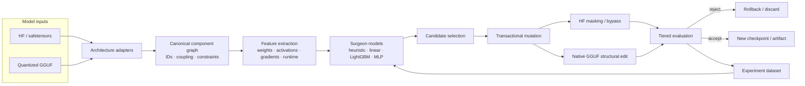

<div align="center">

# ModelSurgeon

**Learn what a neural network can lose — and measure what it costs.**

[](https://github.com/xdCloudy/ModelSurgeon/actions/workflows/ci.yml)
[](https://www.python.org/)
[](ROADMAP.md)
[](LICENSE)

[Architecture](#architecture) · [Quick start](#quick-start) · [First Surgeon](#first-surgeon) · [Native GGUF](#native-gguf-surgery) · [CLI](#cli) · [Roadmap](ROADMAP.md) · [Contributing](CONTRIBUTING.md)

</div>

ModelSurgeon is experimental research software for **learned structural optimization and pruning**. Instead of relying on one hard-coded importance score, it builds a canonical map of model structure, measures static and runtime evidence, runs controlled mutations, learns which edits are likely to be safe, and records enough provenance to reproduce the result.

The project is local-first and deliberately targets both high-precision Hugging Face checkpoints and existing quantized GGUF models. The long-term goal is an automated surgeon that can search for smaller or faster models under explicit quality, memory, latency, and hardware constraints.

> [!IMPORTANT]
> ModelSurgeon is pre-alpha research software. Model surgery can damage checkpoints. Source models are treated as immutable by default, generated outputs are staged separately, and unsupported layouts fail closed rather than being guessed.

## Why ModelSurgeon?

| Principle | What it means |
|---|---|
| **Learn from experiments** | Mutation outcomes become supervised data for heuristic, linear, tree, and neural surgeon models. |
| **Reversible first** | Masking, bypass, rollback, and tiered evaluation are preferred before destructive structural edits. |
| **Quantized models are first-class** | Native GGUF surgery works selectively on affected regions instead of requiring a full floating-point model. |
| **Evidence over intuition** | Model, dataset, tokenizer, schema, seed, hardware, tool revision, metrics, and resource use travel with results. |

## Architecture



Both execution paths share the same component identities, mutation contracts, provenance model, evaluation records, and training data.

| Path | Design |
|---|---|
| **HF / safetensors** | High-precision inspection, hooks, calibration, masking experiments, learned outcome models, and future physical checkpoint resizing. |
| **Native GGUF** | mmap inspection, selective decode, graph-valid structural edits, requantization, unchanged-range copying, resumable output, and external validation. |

The GGUF path is designed so ordinary surgery does **not** require a complete floating-point copy of the model in RAM or on disk.

## Project status

Current package version: **`0.0.1` / pre-alpha**.

The repository is considerably beyond its original scaffold, but it is not yet a stable end-user optimizer.

| Area | Status | Current capability |
|---|---|---|
| Model inspection + component graph | **Implemented** | HF loading, revision provenance, architecture detection, stable IDs, graph discovery, coupling and mutation constraints. |
| Instrumentation + evaluation | **Implemented** | Weight/spectral/activation/gradient/redundancy features, perplexity, latency, memory telemetry, bounded calibration, tiered evaluation. |
| Transactional mutation lab | **Implemented** | MLP/head/component masking, layer bypass, mutation planning, rollback, provenance, single-mutation execution. |
| Experiment datasets | **Implemented** | Canonical examples, grouped splits, leakage audits, persistence, resumability, budgets, OOM/retry infrastructure. |
| Surgeon baselines | **Implemented; empirical proof pending** | Random, magnitude, heuristic, linear, logistic, LightGBM, and small MLP models with immutable bundles. |
| Native GGUF surgery | **Experimental** | Bounded parser, exact codecs, physical planning, MLP-channel/head edits, copy-on-surgery output, requantization controls. |
| Physical HF surgery | **In progress** | Planning contracts exist; physical tensor resize/save-reload workflow remains open. |
| Active learning / cross-model / automated search | **Roadmap** | Planned after the First Surgeon proof and broader validation. |

The roadmap is dependency-driven rather than strictly sequential, so some native GGUF work has landed ahead of later empirical milestones. See [ROADMAP.md](ROADMAP.md).

## Quick start

### Requirements

- Python **3.12+**
- [`uv`](https://docs.astral.sh/uv/)
- optional CUDA-capable PyTorch environment for GPU workflows

Clone and install with Hugging Face support:

```bash
git clone https://github.com/xdCloudy/ModelSurgeon.git
cd ModelSurgeon
uv sync --extra dev --extra hf --locked
```

Inspect a Hugging Face causal LM:

```bash
uv run modelsurgeon inspect <model-id-or-local-path> \
  --device-map cpu \
  --dtype auto
```

Machine-readable output is available with `--json`.

```bash
uv run modelsurgeon --help
```

## CLI

The current public CLI is intentionally small; deeper GGUF surgery components are still library-level APIs while their end-user workflow stabilizes.

| Command | Purpose |
|---|---|
| `inspect` | Load a Hugging Face causal LM and emit canonical model/component records. |
| `experiment` | Resolve, execute, evaluate, and roll back one transactional mutation through a runtime adapter. |
| `first-surgeon-proof` | Build a leakage-safe proof dataset through a generic experiment runtime. |
| `first-surgeon-hf-proof` | Run real Hugging Face MLP-channel masks and create the First Surgeon dataset. |
| `first-surgeon-evidence` | Train/evaluate the proof LightGBMs and compare them with random/magnitude baselines. |
| `train-surgeon` | Train and publish a baseline surgeon from canonical mutation examples. |
| `predict-surgeon` | Score compatible candidates with an immutable persisted surgeon bundle. |

Global logging options:

```text
--log-level LEVEL
--log-format human|json
```

## First Surgeon

The first empirical target is deliberately narrow:

> **Can static + activation features predict the perplexity impact of masking an individual MLP channel better than magnitude or random ranking?**

The full proof pipeline is already implemented; the remaining milestone work is the real several-thousand-mutation campaign and empirical evidence.

<details>
<summary><strong>Run the First Surgeon proof</strong></summary>

### 1. Generate a real mutation dataset

For Hugging Face causal LMs with a standard gated `gate_proj` / `up_proj` / `down_proj` MLP:

```bash
uv run modelsurgeon first-surgeon-hf-proof <model-id-or-local-path> ./calibration.txt \
  --output ./proof-data \
  --max-candidates 5000 \
  --sequence-length 256 \
  --max-tokens 4096 \
  --safe-perplexity-delta 0.25 \
  --seed 42 \
  --split-seed 43 \
  --tool-revision "$(git rev-parse HEAD)"
```

This produces:

```text
proof-data/
├── examples.jsonl
├── split.json
├── leakage.json
└── campaign.json
```

The campaign fails rather than publishing a dataset if a split is empty or the leakage audit finds contamination.

### 2. Install the optional LightGBM backend

```bash
uv pip install "lightgbm>=4,<5"
```

### 3. Train and compare the held-out models

```bash
uv run modelsurgeon first-surgeon-evidence ./proof-data/examples.jsonl \
  --split ./proof-data/split.json \
  --registry ./proof-data/registry \
  --output ./proof-data/first-surgeon-evidence.json \
  --safe-perplexity-delta 0.25 \
  --threads 4 \
  --seed 42 \
  --top-n 50 \
  --bootstrap-repetitions 1000
```

The evidence report includes held-out grouped metrics, random/magnitude comparisons, immutable artifact digests, source revisions, inference smoke tests, and training resource telemetry.

</details>

See [docs/first-surgeon-proof.md](docs/first-surgeon-proof.md) for the protocol and acceptance criteria.

## Train a surgeon baseline

`train-surgeon` supports:

```text
linear
logistic
lightgbm-regressor
lightgbm-classifier
mlp-regressor
mlp-classifier
```

Example:

```bash
uv run modelsurgeon train-surgeon ./examples.jsonl \
  --split ./split.json \
  --registry ./artifacts/surgeons \
  --target perplexity \
  --baseline lightgbm-regressor \
  --threads 4 \
  --seed 42
```

Then score compatible candidates with the emitted immutable bundle digest:

```bash
uv run modelsurgeon predict-surgeon ./candidate.json \
  --registry ./artifacts/surgeons \
  --bundle sha256:<digest> \
  --json
```

Inference refuses records with missing required features or incompatible preprocessing/schema contracts.

## Native GGUF surgery

GGUF is a first-class analysis and physical-surgery format, not merely an export target.

| Capability | Current support |
|---|---|
| Container I/O | Bounded read-only mmap parser for GGUF v2/v3, lazy tensor handles, chunk/range reads. |
| Dense codecs | F32, F16, BF16, Q8_0, Q6_K, Q5_K, Q4_K, Q3_K, Q2_K. |
| IQ codecs | Prioritized IQ4 paths with unsupported IQ layouts rejected explicitly. |
| Architecture mappings | Supported dense Llama, Qwen, Mistral, and finite Gemma variants; unsupported/newer semantics fail closed. |
| Structural edits | Native quantized MLP-channel and attention-head planning/execution. |
| Memory model | Full, tensor, and streaming modes with RAM/VRAM/scratch estimates and disk-backed intermediates. |
| Output | Copy untouched encoded ranges, selectively decode changed blocks, requantize, checksum, resume, and atomically publish. |
| Controls | Matched no-surgery requantization controls separate quantization loss from surgery loss. |
| External validation | Pinned `llama.cpp` invocation/provenance is implemented; broader real-artifact acceptance is still being validated. |

Unsupported architecture families, MoE layouts, quantization formats, and unsafe mutation geometries are rejected rather than approximated silently.

For the detailed design, see [ARCHITECTURE.md](ARCHITECTURE.md) and [`docs/design/`](docs/design/).

## Safety and reproducibility invariants

- **Never silently reinterpret structure.** Stable component IDs and explicit old-to-new mappings survive physical edits.
- **Never overwrite a source checkpoint by default.** New outputs stage separately and publish atomically.
- **Never guess unsupported formats.** Unknown model families, tensor axes, codecs, or constraints fail closed.
- **Never hide leakage.** Dataset splits are grouped around structural identity rather than randomized row-by-row after generation.
- **Never hide precision context.** Feature records preserve storage/compute precision and quantization provenance.
- **Never assume datacenter hardware.** Large operations are bounded, chunked, resumable, and designed around consumer-class memory limits.

## Reference hardware

The architecture is developed around a consumer-workstation envelope: approximately a **12 GB NVIDIA GPU and 64 GB system RAM**, with CPU-only paths where practical.

That is a design target, not a promise that every model or future surgery workflow will fit the same machine.

## Repository layout

```text
src/modelsurgeon/
├── adapters/         # HF, safetensors, GGUF and architecture boundaries
├── graph/            # component IDs, topology, coupling and constraints
├── features/         # static, spectral, activation, gradient and runtime features
├── instrumentation/  # calibration, hooks and bounded aggregation
├── surgery/          # mutation contracts, masks, physical edits and rollback
├── evaluation/       # structural, perplexity, latency and external validation
├── experiments/      # identity, persistence, budgets, queues and reproducibility
├── datasets/         # mutation examples, stores, splits and leakage audits
├── surgeon/          # heuristic and learned decision models
├── search/           # candidate/search infrastructure
├── explain/          # explanation/report infrastructure
└── cli/              # user-facing workflows
```

## Development

```bash
uv sync --extra dev --extra hf --locked
uv run ruff check .
uv run mypy src
uv run pytest --cov=modelsurgeon --cov-report=term-missing
```

Pull-request CI runs the full quality suite plus real local Transformers First Surgeon and optional LightGBM integration smoke tests.

## Documentation

- [Architecture](ARCHITECTURE.md)
- [Roadmap](ROADMAP.md)
- [Changelog](CHANGELOG.md)
- [First Surgeon proof protocol](docs/first-surgeon-proof.md)
- [Design notes / ADRs](docs/design/)
- [Contributing](CONTRIBUTING.md)
- [Security](SECURITY.md)
- [Citation metadata](CITATION.cff)

## License

Apache-2.0. Model, dataset, tokenizer, and upstream-tool licenses remain the responsibility of their users.
