# ModelSurgeon Roadmap

The GitHub Project is the execution source of truth; this document explains its milestones and critical path. Every Project leaf is intended to fit roughly 0.5–2 focused engineering days and has objective acceptance criteria, tests, ownership fields and dependencies.

```mermaid
flowchart LR
  A[v0.1 Foundation] --> B[v0.2 Instrumentation]
  B --> C[v0.3 Mutation Lab]
  C --> D[v0.4 Experiment Dataset]
  D --> E[v0.5 First Surgeon]
  E --> F[v0.6 Active Surgeon]
  C --> G[v0.7 Structural + Native GGUF Surgery]
  F --> H[v0.8 Cross-Model Generalization]
  G --> H
  H --> I[v0.9 Automated Optimization]
  I --> J[v1.0 ModelSurgeon]
  J --> K[v1.1 Competitive Ground Truth]
  K --> L[v1.2 Physical Deployment Pareto]
  L --> M[v1.3 Hardware-Aware Surgery]
  M --> N[v1.4 Multi-Axis Optimization]
  N --> O[v1.5 State-Dependent Surgeon]
  O --> P[v1.6 Cross-Model Meta-Surgeon]
  P --> Q[v1.7 Learned Repair]
  Q --> R[v1.8 Scientific Rigor]
  R --> S[v1.9 Production Ecosystem]
  S --> T[v2.0 Autonomous Optimizer]
  T --> U[v2.1 OptimizationSpec Compiler]
  U --> V[v2.2 Provider Layer]
  U --> W[v2.3 Chat Vertical Slice]
  V --> W
  W --> X[v2.4 Clarification]
  X --> Y[v2.5 Constraint Negotiation]
  V --> Z[v2.6 Bounded Tools]
  Z --> AA[v2.7 Stateful Campaigns]
  AA --> AB[v2.8 Evidence Explanations]
  AB --> AC[v2.9 Approval + Security]
  AC --> AD[v3.0 Conversational Product]
  Y --> AD
  W --> AD
```



## v0.1 — Foundation

Establish repository quality, reproducible configuration/logging, safe hardware discovery, Hugging Face and safetensors loading, stable component identities, architecture discovery and the coupling graph. Specify GGUF container, quantization and architecture boundaries now so the low-hardware path is not bolted on later.

## v0.2 — Instrumentation

Add calibration datasets, lifecycle-safe activation and gradient collection, streaming aggregation, static/spectral/runtime/redundancy features, versioned records and quantization provenance. Demonstrate bounded collection on the 12 GB reference GPU and CPU.

## v0.3 — Mutation Lab

Implement the transactional mutation contract, masking for heads/channels/components, layer bypass, rollback/provenance and tier 0/1 evaluation. Deliver the first safe mask-and-measure loop before physical resizing.

## v0.4 — Experiment Dataset

Build migrated SQLite metadata, Parquet features/examples, content-addressed artifacts, resumable queues, hardware budgets, OOM recovery and automated mutation campaigns. Produce a leakage-checked training dataset with thousands of small-model examples.

## v0.5 — First Surgeon

Train heuristic, magnitude, random, linear/logistic, LightGBM and small-MLP baselines. Measure AUC, delta-perplexity MAE/RMSE and precision at top N on held-out components. Quantization and feature precision are explicit covariates.

## v0.6 — Active Surgeon

Calibrate probabilities and uncertainty, generate and deduplicate large candidate pools, combine uncertainty/utility/diversity, schedule within budgets and trigger iterative retraining. Test whether active learning reduces required experiments.

## v0.7 — Structural and Native GGUF Surgery

Physically resize HF/safetensors tensors and implement first-class out-of-core GGUF surgery. Deliver mmap/lazy/container I/O, exact quantization codecs, bounded decode/encode, transactional streaming output, architecture adapters, MLP/head/layer/low-rank mutations and llama.cpp validation. The milestone proof physically removes a Q4_K_M MLP channel group without a full floating-point model, then reports size, parameters, perplexity, quality, throughput and peak RAM.

## v0.8 — Cross-Model Generalization

Evaluate Llama, Qwen, Mistral and Gemma families across roughly 100M to 7B where practical. Add model- and architecture-held-out protocols, native GGUF compatibility matrices, quantization controls and systematic research experiments Q1–Q8.

## v0.9 — Automated Optimization

Implement constrained multi-objective search across sequences of graph-valid mutations, Pareto tracking, keep/rollback policies, LoRA/short-fine-tuning/distillation repair and iterative surgery comparisons. Support full/tensor/streaming memory-mode planning.

## v1.0 — ModelSurgeon

This is the current unfinished milestone. Stabilize public schemas and CLI workflows; complete explainability, reports, reproduce/export commands, performance/regression suites, security hardening, release docs and reproducible reference experiments on consumer hardware. Post-v1 work remains blocked by its declared open v1.0 prerequisites; it does not replace or imply completion of them.

## v1.1 — Competitive Benchmarking and Ground Truth

Implement strong Wanda, SparseGPT, structured-pruning and quantized baselines behind equal-budget contracts. Exit with reproducible, statistically defensible quality/throughput/memory/size/cost Pareto evidence on physically deployable artifacts. New search algorithms are out of scope.

## v1.2 — Physical Compression and Deployment Pareto Optimization

Make cumulative HF and GGUF surgery physically smaller, reloadable and measurable, with artifact-correctness gates and explicit surgery-versus-quantization loss. Exit with deployment frontiers and retained failure evidence; a learned hardware policy is deferred.

## v1.3 — Hardware-Aware Surgery

Profile target machines and learn measured kernel/alignment/resource costs rather than treating parameter count as deployment benefit. Exit when conditioned decisions improve or honestly fail to improve held-out consumer-hardware frontiers.

## v1.4 — Multi-Axis Architecture Optimization

Represent complete architecture states and search graph-valid combinations of depth, width, heads, MLP channels, rank and precision. Exit with bounded beam/evolutionary/surrogate search and physically validated Pareto candidates; interaction learning belongs to v1.5.

## v1.5 — Interaction-Aware and State-Dependent Surgeon

Collect ordered mutation interactions and condition predictions on cumulative architecture state. Exit when long-sequence studies quantify cumulative regret, violations, rollbacks and evaluation cost against stateless/additive baselines.

## v1.6 — Cross-Model Meta-Surgeon

Define lineage-safe model meta-features, compatibility rules and transfer confidence. Exit with four-family zero/few-shot evidence showing when transferable knowledge saves target evaluations and when target-specific retraining is required.

## v1.7 — Learned Recovery, Distillation and Repair

Predict recoverability and repair cost, then jointly choose surgery, repair and quantization under consumer budgets. Exit with measured no-repair, LoRA, fine-tuning, distillation and oracle comparisons; repair is never assumed to rescue an unsafe mutation.

## v1.8 — Robustness, Security, Validation and Scientific Rigor

Add hostile artifacts, mutation properties, crash consistency, cross-platform numerical validation, leakage controls, signed evidence and clean-environment reproduction. Exit only after independent audit of claims and retained negative/failed cells.

## v1.9 — Production UX, Ecosystem and Large-Scale Optimization

Deliver a resumable `optimize` workflow, worker scheduling, artifact registry, stable plugin/runtime interfaces, an evidence explorer and representative user workflows. Exit with practical local and multi-worker campaigns; autonomous policy selection remains v2.0 work.

## v2.0 — Autonomous Evidence-Driven Model Optimizer

Turn a constrained user objective and hardware profile into an auditable capability space, strategy, mutation/evaluation/repair/quantization workflow and deployable alternatives. Exit with human approval gates, deterministic replay, a competitive reference benchmark, signed release artifacts and a scientific report that clearly separates verified, experimental, unsupported and unknown capabilities.

## v2.1 — Natural-language OptimizationSpec Compiler (contract frozen)

[GitHub milestone](https://github.com/xdCloudy/ModelSurgeon/milestone/22). Compile plain-English intent into the stable v2 `OptimizationSpec` contract. Entry is the frozen v2.0 objective/API boundary, especially #422; the bounded exit is recorded in [`docs/design/conversational-intent-contract.md`](docs/design/conversational-intent-contract.md) and [`docs/research/v2.1-conversational-intent-contract-v1.json`](docs/research/v2.1-conversational-intent-contract-v1.json): deterministic serialization, provenance, confidence/ambiguity/refusal behavior, retained negative evidence, and rephrasing/refusal tests. This is a control-plane compiler only: it cannot choose tensors, relax hard constraints or promote artifacts. `modelsurgeon chat` and the later provider, clarification, state, tool-execution, and explanation layers remain planned work.

## v2.2 — Replaceable Text-model Provider Layer (boundary frozen)

[GitHub milestone](https://github.com/xdCloudy/ModelSurgeon/milestone/23). Make the conversational model replaceable across local GGUF, compatible endpoints, supported hosted providers and no-LLM direct APIs. The bounded exit is recorded in [`docs/release/v2.2-provider-layer-boundary.md`](docs/release/v2.2-provider-layer-boundary.md) and its machine-readable release record: provider capability discovery, configuration, isolation, failure semantics, explicit unsupported cells and conformance evidence. Core execution remains provider-neutral and local-first remains a first-class target. `modelsurgeon chat`, universal hosted support and live provider benchmarks remain later work.

## v2.3 — `modelsurgeon chat` Vertical Slice

[GitHub milestone](https://github.com/xdCloudy/ModelSurgeon/milestone/24). Deliver the first supported `modelsurgeon chat <model>` workflow: inspect the selected model and hardware, compile and show the interpreted spec, then call stable ModelSurgeon APIs. Entry is v2.1, v2.2 and the v2.0 optimize/release foundation; exit is a clean-environment inspect → preview → execute acceptance path. The chat harness is not a second optimizer.

## v2.4 — Conversational Clarification and Ambiguity Handling

[GitHub milestone](https://github.com/xdCloudy/ModelSurgeon/milestone/25). Add a deterministic, necessary-only clarification state machine for vague, incomplete or contradictory requests. Entry is the v2.3 vertical slice and v2.1 ambiguity contract; exit is safe handling of missing metrics, deployment targets, conflicting constraints and preference ordering, with measurable-question and refusal evidence. The system must avoid both silent guessing and unnecessary interrogation.

## v2.5 — Constraint Negotiation and Infeasibility Explanation

[GitHub milestone](https://github.com/xdCloudy/ModelSurgeon/milestone/26). Explain when measured candidates cannot satisfy the declared objective, show grounded Pareto alternatives and record any user-approved amendment immutably. Entry is v2.4 plus v2.0 evidence/approval primitives; exit is explicit infeasibility, measured alternatives, preserved original constraints and reproducible amendment history. Predictions are never presented as measurements and constraints are never loosened silently.

## v2.6 — Bounded Conversational Tool Calling

[GitHub milestone](https://github.com/xdCloudy/ModelSurgeon/milestone/27). Formalize the typed, capability-scoped API boundary between text models and ModelSurgeon. Entry is v2.2 provider contracts and v1.9/v2.0 plugin, transaction, approval and provenance work; exit is allowlisted schemas, budgets, read-only/consequential separation, grounded result envelopes and adversarial boundary tests. Arbitrary shell/code execution is outside the tool surface.

## v2.7 — Stateful Conversational Campaigns

[GitHub milestone](https://github.com/xdCloudy/ModelSurgeon/milestone/28). Persist canonical campaign state while supporting pause, resume, cancel, reconnect, restart, stale-context detection and bounded history summarization. Entry is v2.3, v2.6, v1.9 resumability and v2.0 campaign state; exit is deterministic recovery with structured state authoritative over chat history. New evidence or plan changes must create visible versioned transitions.

## v2.8 — Evidence-grounded Explanations

[GitHub milestone](https://github.com/xdCloudy/ModelSurgeon/milestone/29). Explain accepted, rejected, rolled-back, failed, unsupported, uncertain and Pareto outcomes using canonical evidence. Entry is v2.6 result grounding, v2.7 state and v2.0 evidence packages; exit is claim-to-evidence traceability, explicit uncertainty and retained negative results. The conversational layer may summarize evidence but cannot manufacture it.

## v2.9 — Approval Gates and Conversational Security Hardening

[GitHub milestone](https://github.com/xdCloudy/ModelSurgeon/milestone/30). Harden the complete control plane with scoped approvals, expiry, plan diffs, provider/tool isolation, redaction, prompt-injection resistance, adversarial tests and fail-closed policy precedence. Entry is v2.6, v2.8 and v1.8-v2.0 security/provenance primitives; exit is a reviewed residual-risk posture with no conversational bypass around hard constraints, evidence or transaction boundaries.

## v3.0 — Conversational ModelSurgeon Product Release

[GitHub milestone](https://github.com/xdCloudy/ModelSurgeon/milestone/31). Make conversation the primary supported UX while retaining direct CLI/Python automation. Entry is the v2.1-v2.9 stack and v2.0 release evidence; exit is an integrated local-first product workflow with setup, provider selection, diagnostics, campaign management, grounded explanations, approvals, migration guarantees, packaging guidance and end-to-end security/reproducibility acceptance. `Surgeon Tensors/` remains the learned Meta-Surgeon, `Text LLM/` remains the replaceable conversational model, and `Models/` remains user/target model data. v3.1+ returns the main research emphasis to the learned Meta-Surgeon.

## Central critical path

```text
configuration and safety contracts
  -> stable component IDs
  -> HF + GGUF architecture discovery
  -> coupling graph and constraint validation
  -> instrumentation + versioned features
  -> transactional masking + tiered evaluation
  -> experiment schema/store + resumable campaign runner
  -> leakage-safe dataset
  -> LightGBM surgeon + calibrated uncertainty
  -> active candidate scheduler
  -> physical mutation planner
  -> quantization codecs + streaming GGUF writer
  -> native Q4_K_M MLP proof
  -> cross-model/quantization evaluation
  -> constrained iterative search
  -> reproducible v1.0 workflow
  -> equal-budget competitor ground truth
  -> physical deployment Pareto evidence
  -> measured hardware-conditioned cost models
  -> multi-axis architecture-state search
  -> interaction-aware cumulative prediction
  -> cross-family meta-learning
  -> joint surgery + repair + quantization economics
  -> hostile-input and signed-evidence audit
  -> resumable production optimize workflow
  -> autonomous objective-to-artifact v2.0 release
  -> plain-English intent to validated OptimizationSpec
  -> replaceable text-model provider boundary
  -> inspect/preview/execute chat vertical slice
  -> necessary clarification and contradiction handling
  -> measured infeasibility and approved amendments
  -> bounded typed tools and grounded results
  -> canonical stateful campaigns and recovery
  -> evidence-grounded explanations
  -> scoped approvals and conversational security hardening
  -> integrated conversational v3.0 product with direct APIs preserved
```

## Scientific questions

The tracked research program asks whether static features predict safe pruning; how much activations and gradients add; whether learned rankings beat magnitude and random baselines; whether predictions transfer across models and families; whether active learning reduces experiments; whether iterative surgery beats one-shot pruning; which quantized features remain reliable; and how surgery loss separates from requantization loss.

Post-v1 research extends those questions without erasing negative results: whether ModelSurgeon is competitive under equal deployment budgets; which physical mutations create real hardware gains; whether cumulative interactions, meta-learning and recoverability estimates generalize; and whether an autonomous policy can produce a better feasible frontier with fewer evaluations while preserving provenance, safety and human control.

The [ModelSurgeon Roadmap Project](https://github.com/users/xdCloudy/projects/2) is the source of truth for individual issue status, priority, effort, risk, phase and native blocker relationships.

