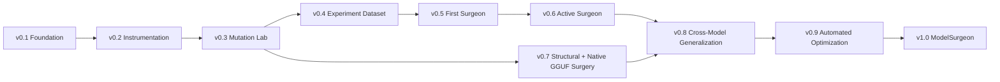

# ModelSurgeon Roadmap

The GitHub Project is the execution source of truth; this document explains its milestones and critical path. Every Project leaf is intended to fit roughly 0.5–2 focused engineering days and has objective acceptance criteria, tests, ownership fields and dependencies.



## v0.1 — Foundation

Establish repository quality, reproducible configuration/logging, safe hardware discovery, Hugging Face and safetensors loading, stable component identities, architecture discovery and the coupling graph. Specify GGUF container, quantization and architecture boundaries now so the low-hardware path is not bolted on later.

## v0.2 — Instrumentation

Add calibration datasets, lifecycle-safe activation and gradient collection, streaming aggregation, static/spectral/runtime/redundancy features, versioned records and quantization provenance. Demonstrate bounded collection on the 12 GB reference GPU and CPU.

## v0.3 — Mutation Lab

Implement the transactional mutation contract, masking for heads/channels/components, layer bypass, rollback/provenance and tier 0/1 evaluation. Deliver the first safe mask-and-measure loop before physical resizing.

## v0.4 — Experiment Dataset

Build migrated SQLite metadata, Parquet features/examples, content-addressed artifacts, resumable queues, hardware budgets, OOM recovery and automated mutation campaigns. Produce a leakage-checked training dataset with thousands of small-model examples.

## v0.5 — First Surgeon

Train heuristic, magnitude, random, linear/logistic, LightGBM and small-MLP baselines. Measure AUC, delta-perplexity MAE/RMSE and precision at top N on held-out components. Quantization and feature precision are explicit covariates.

## v0.6 — Active Surgeon

Calibrate probabilities and uncertainty, generate and deduplicate large candidate pools, combine uncertainty/utility/diversity, schedule within budgets and trigger iterative retraining. Test whether active learning reduces required experiments.

## v0.7 — Structural and Native GGUF Surgery

Physically resize HF/safetensors tensors and implement first-class out-of-core GGUF surgery. Deliver mmap/lazy/container I/O, exact quantization codecs, bounded decode/encode, transactional streaming output, architecture adapters, MLP/head/layer/low-rank mutations and llama.cpp validation. The milestone proof physically removes a Q4_K_M MLP channel group without a full floating-point model, then reports size, parameters, perplexity, quality, throughput and peak RAM.

## v0.8 — Cross-Model Generalization

Evaluate Llama, Qwen, Mistral and Gemma families across roughly 100M to 7B where practical. Add model- and architecture-held-out protocols, native GGUF compatibility matrices, quantization controls and systematic research experiments Q1–Q8.

## v0.9 — Automated Optimization

Implement constrained multi-objective search across sequences of graph-valid mutations, Pareto tracking, keep/rollback policies, LoRA/short-fine-tuning/distillation repair and iterative surgery comparisons. Support full/tensor/streaming memory-mode planning.

## v1.0 — ModelSurgeon

Stabilize public schemas and CLI workflows; complete explainability, reports, reproduce/export commands, performance/regression suites, security hardening, release docs and reproducible reference experiments on consumer hardware.

## Central critical path

```text
configuration and safety contracts
  -> stable component IDs
  -> HF + GGUF architecture discovery
  -> coupling graph and constraint validation
  -> instrumentation + versioned features
  -> transactional masking + tiered evaluation
  -> experiment schema/store + resumable campaign runner
  -> leakage-safe dataset
  -> LightGBM surgeon + calibrated uncertainty
  -> active candidate scheduler
  -> physical mutation planner
  -> quantization codecs + streaming GGUF writer
  -> native Q4_K_M MLP proof
  -> cross-model/quantization evaluation
  -> constrained iterative search
  -> reproducible v1.0 workflow
```

## Scientific questions

The tracked research program asks whether static features predict safe pruning; how much activations and gradients add; whether learned rankings beat magnitude and random baselines; whether predictions transfer across models and families; whether active learning reduces experiments; whether iterative surgery beats one-shot pruning; which quantized features remain reliable; and how surgery loss separates from requantization loss.

