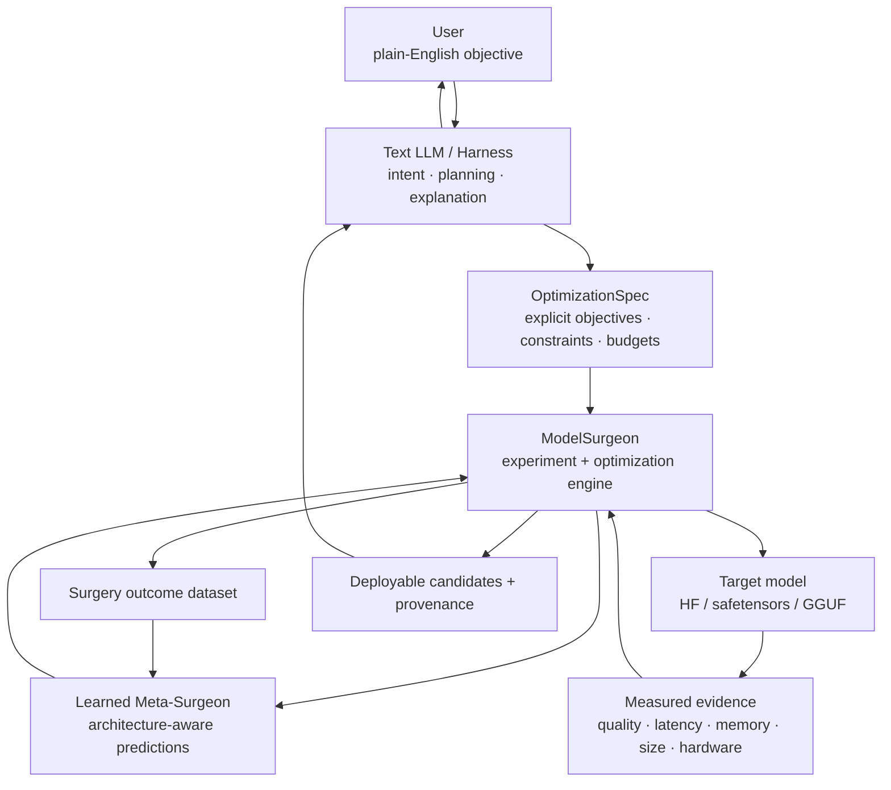

# Long-Term Goal

ModelSurgeon’s long-term goal is to become an **evidence-driven, autonomous model-optimization system that people can control in plain English**.

The end state is not a language model that directly edits neural networks by intuition. It is a layered system in which a general-purpose text LLM understands the user, ModelSurgeon owns the scientific execution loop, and a specialized learned surgeon increasingly learns how neural-network structure responds to surgery.

This document is a north-star design goal, not a claim about current capability. The [roadmap](../ROADMAP.md) remains the execution source of truth.

## Target experience

A user should eventually be able to provide a model and describe the desired outcome naturally:

> Make this model run entirely in 6 GB of VRAM. Prioritize generation speed, preserve coding ability, and do not accept more than roughly 1% quality loss.

The system should translate that intent into an explicit, auditable optimization specification, inspect the target model and hardware, search the feasible architecture space, run real measurements, reject unsafe or poor candidates, and return one or more physically deployable artifacts with evidence explaining the trade-offs.

A successful interaction could ultimately look like:

```text
$ modelsurgeon chat qwen-model.gguf

ModelSurgeon:
I inspected the model and detected your hardware.
What are you trying to achieve?

User:
I need it below 6 GB VRAM and I want at least 45 tok/s.
Keep coding quality as close as possible.

ModelSurgeon:
I translated that into a constrained optimization objective:
- VRAM ceiling: 6 GB
- primary objective: generation throughput
- coding quality: high-priority guardrail
- quality-loss budget: conservative

I will only accept candidates that satisfy the declared constraints.
```

The important property is that the conversational layer does **not** silently become the authority deciding which tensors to remove. Natural language defines intent; ModelSurgeon remains responsible for measurable optimization.

## Proposed architecture



The three layers have deliberately different responsibilities.

### 1. Text LLM: understand humans

The text model acts as the conversational control plane. It should:

- understand plain-English requests;
- identify optimization objectives and trade-offs;
- ask for clarification only when required to make the objective executable;
- convert intent into a versioned structured specification;
- call ModelSurgeon through stable tools or APIs;
- summarize measured results and rejected alternatives;
- explain why the final artifact satisfies, or fails to satisfy, the requested constraints.

The LLM should be replaceable. A local Llama-, Qwen-, Gemma-, or other compatible model, a hosted model, or a non-LLM client should all be able to drive the same underlying ModelSurgeon contract.

The language model is therefore an **interface and planner**, not the source of truth for surgery quality.

### 2. ModelSurgeon: own execution and evidence

ModelSurgeon remains the deterministic and auditable execution layer. It should own:

- model and hardware inspection;
- canonical component identities and constraints;
- feature and instrumentation collection;
- candidate generation;
- mutation planning;
- transactional surgery and rollback;
- benchmark and quality evaluation;
- budget enforcement;
- Pareto-frontier tracking;
- artifact publication;
- provenance and reproducibility;
- retention of positive and negative experimental evidence.

The LLM may request actions, but predictions must never silently become accepted checkpoints. Acceptance remains grounded in explicit policy and measured evidence.

### 3. Learned Meta-Surgeon: understand neural networks

The long-term learned surgeon should evolve beyond scoring one tabular candidate at a time.

Its eventual job is to learn transferable knowledge about **neural-network anatomy** from accumulated surgery outcomes. Rather than only asking whether one MLP channel appears removable, a mature surgeon should reason over architecture state, interactions, hardware and previous mutations.

Potential inputs include:

- model family and architecture metadata;
- complete layer/component structure;
- attention heads, MLP groups, experts, ranks and precision choices;
- static, spectral, activation and gradient evidence;
- quantization and feature precision;
- target hardware and measured kernel behaviour;
- current cumulative architecture state;
- previous accepted and rejected surgeries;
- repair/distillation outcomes;
- user objective and hard constraints.

Potential outputs include:

- predicted quality deltas;
- latency, memory and size deltas;
- uncertainty estimates;
- candidate rankings;
- interaction-risk estimates;
- repairability estimates;
- sequences of proposed surgical operations;
- confidence that knowledge transfers to the current model family.

The architecture of this learned surgeon should be determined by evidence rather than branding. A future implementation may use a transformer, graph transformer, graph neural network, sequence model or another architecture if it demonstrably improves held-out optimization performance.

## Why keep the text LLM and learned surgeon separate?

A general-purpose LLM and a learned model optimizer solve different problems.

The text LLM needs to understand:

- human intent;
- vague requirements;
- trade-offs expressed conversationally;
- explanations and interaction.

The learned surgeon needs to understand:

- neural-network structure;
- component interactions;
- mutation consequences;
- hardware-dependent cost;
- optimization under constrained budgets.

Combining those responsibilities into one language model would make the scientific decision path harder to validate, harder to reproduce and unnecessarily dependent on natural-language reasoning.

The preferred separation is:

```text
human intent
    ↓
text LLM
    ↓
structured OptimizationSpec
    ↓
ModelSurgeon execution engine
    ↕
learned Meta-Surgeon
    ↓
measured candidate artifacts
    ↓
text LLM explanation
```

This lets each layer improve independently.

## Structured intent, not prompt-driven surgery

Natural-language requests should be compiled into an explicit contract before optimization begins.

For example:

```yaml
objective:
  primary: generation_throughput
  secondary: model_size

constraints:
  max_vram_gb: 6
  max_quality_loss_percent: 1.0

quality:
  preserve:
    - coding
    - instruction_following

allowed_operations:
  - mlp_width_pruning
  - attention_head_pruning
  - layer_pruning
  - precision_change

hardware:
  detect: true

search:
  evaluation_budget: 500
```

The exact schema will evolve, but the principle should remain stable: **the user’s request becomes inspectable data before destructive work begins**.

That creates a clear chain of responsibility:

```text
request
  → interpreted objective
  → declared constraints
  → proposed experiments
  → measured evidence
  → accept / reject decisions
  → deployable artifact
```

## The data flywheel

Every valid surgery experiment can become training evidence for future learned surgeons.

A mature dataset may contain records such as:

```text
model_before
architecture_state
candidate_operation
static_features
activation_features
gradient_features
hardware_profile
quality_before
quality_after
latency_before
latency_after
memory_before
memory_after
quantization_state
operation_history
repair_result
accepted_or_rejected
```

The long-term flywheel is:

```text
more surgeries
    ↓
richer outcome dataset
    ↓
better learned surgeon
    ↓
better candidate ranking and search
    ↓
more useful surgeries per unit of compute
    ↓
richer outcome dataset
```

The value of the dataset depends on diversity, not only size. Millions of near-duplicate mutations on one small model are less useful than evidence spanning multiple architectures, model sizes, tasks, mutation types, quantizations and hardware targets.

The eventual research question is therefore not simply whether a classifier can beat magnitude pruning on one campaign. It is whether **optimization knowledge scales and transfers as the surgery corpus becomes broader and the learned surgeon becomes more capable**.

## From candidate scoring to operation sequences

The current learned-surgeon path begins with prediction over individual candidates. A longer-term system should be able to reason about state-dependent sequences.

Instead of only:

```text
candidate → predicted quality delta
```

it should eventually support policies closer to:

```text
current model + hardware + objective
    ↓
propose width reduction in layers 8–14
    ↓
measure
    ↓
propose attention changes conditioned on the new state
    ↓
measure
    ↓
change precision in selected layers
    ↓
measure
    ↓
run bounded repair if justified
    ↓
measure
    ↓
STOP when the best feasible frontier is reached
```

This aligns with the roadmap’s progression toward multi-axis architecture optimization, state-dependent surgery, cross-model meta-learning, learned repair and an autonomous optimizer.

## Scaling the learned surgeon

A larger learned surgeon is not automatically a better surgeon.

Model capacity should scale only when held-out evidence shows that additional data and model capacity improve useful optimization metrics such as:

- cross-model prediction error;
- candidate-ranking quality;
- search regret;
- evaluations required to reach a feasible frontier;
- transfer performance on held-out model families;
- quality/latency/memory Pareto performance;
- calibration and uncertainty quality.

An illustrative research progression might be:

```text
Dataset:  3K → 10K → 100K → 1M → 10M+ diverse outcomes
Surgeon:  6K → 100K → 1M → 10M → 100M+ parameters
```

Those numbers are not commitments. The criterion is empirical scaling behaviour. If a small model saturates, keep it small. If larger structured models continue reducing search cost and generalizing across architectures, increase capacity deliberately.

## Product packaging and local installation

The mature product should feel like normal installable software even though it may manage large model files, learned surgeon tensors, datasets and experiment artifacts.

On Windows, a future release may ship through a conventional installer such as:

```text
Setup.exe
```

The application binaries should use a conventional protected installation path by default:

```text
C:\Program Files\ModelSurgeon\
├── ModelSurgeon.exe
├── modelsurgeon-cli.exe
├── runtime\
└── uninstall.exe
```

Large mutable data should live separately. The default should be `%LOCALAPPDATA%\ModelSurgeon\` rather than roaming `%APPDATA%`, because surgeon tensors, text LLMs, caches, optimized models and experiment evidence may be many gigabytes and should not be treated as roaming profile data.

The installer should make this data root user-selectable so a user can instead choose a secondary SSD or another appropriate location such as `D:\ModelSurgeon\`.

An illustrative data layout is:

```text
%LOCALAPPDATA%\ModelSurgeon\
├── Surgeon Tensors\            ← ModelSurgeon's learned Meta-Surgeon brain
│   ├── meta-surgeon-current\
│   ├── meta-surgeon-previous\
│   └── registry.json
│
├── Text LLM\                   ← conversational language model only
│   ├── modelsurgeon-chat.gguf
│   └── config.json
│
├── Models\                     ← user/target models ModelSurgeon operates on
├── Campaigns\
│   ├── active\
│   └── completed\
├── Evidence\
├── Benchmarks\
├── Artifacts\
├── Cache\
├── Logs\
├── Config\
│   └── modelsurgeon.toml
└── README.md
```

The exact names and layout may evolve, but several conceptual separations should remain clear.

### Surgeon Tensors — ModelSurgeon’s learned brain

`Surgeon Tensors/` contains **ModelSurgeon’s own learned Meta-Surgeon checkpoint: the specialist neural model that acts as ModelSurgeon’s learned brain for model surgery**.

It is not a general model-storage folder. It does **not** contain the user models that ModelSurgeon is optimizing, and it does **not** contain the conversational text LLM. Those belong in `Models/` and `Text LLM/` respectively.

Conceptually:

```text
Surgeon Tensors/
    = ModelSurgeon's learned brain
    = the Meta-Surgeon itself
    = learned surgery knowledge accumulated from training evidence

Text LLM/
    = the model that understands and talks to the user

Models/
    = the external/target models being inspected and optimized
```

The Meta-Surgeon stored here is the learned component that increasingly understands neural-network anatomy: which structures are likely redundant, how mutations may interact, how quality and deployment metrics may change, and which candidate operations are worth testing. ModelSurgeon’s deterministic execution engine remains responsible for actually performing, measuring, accepting or rejecting those operations.

A future Meta-Surgeon brain bundle might contain:

```text
Surgeon Tensors\
└── modelsurgeon-meta-v3.4\
    ├── model.safetensors
    ├── config.json
    ├── preprocessing.json
    ├── compatibility.json
    └── model-card.json
```

The Meta-Surgeon’s storage format should follow whichever learned architecture performs best. It may eventually be GGUF-compatible if the chosen surgeon architecture can be executed appropriately, but ModelSurgeon should not force its brain into GGUF merely for packaging convenience.

### Text LLM

`Text LLM/` stores the optional language model used by the conversational harness. A local quantized GGUF is a natural fit here, particularly for an offline/local-first product.

For example:

```text
Text LLM\
└── modelsurgeon-chat-qwen-q4_k_m.gguf
```

The text LLM should remain replaceable. Users may select a bundled local model, another local compatible model, a separately hosted OpenAI-compatible endpoint, another supported provider, or no conversational model at all when using the structured CLI/Python API directly.

### User README

The data root should include a short `README.md` explaining what ModelSurgeon is, how to launch it, where outputs are stored, and the distinction between the text LLM and surgeon tensors.

The README should be written for users rather than researchers and should cover a minimal path such as:

```text
1. Launch ModelSurgeon.
2. Select or provide a model.
3. Describe what you want to optimize.
4. Review the interpreted constraints and planned campaign.
5. Approve execution.
6. Review measured candidates and trade-offs.
7. Export or select the preferred optimized artifact.
```

Advanced documentation can remain in the repository and application help system; the installed README should primarily help a user understand the product and its local data.

## Product eras beyond v2.0

The roadmap should be free to evolve based on evidence, but the long-term product direction can be divided into three broad eras.

### v1.0–v2.0: build the optimization engine

The first era focuses on making ModelSurgeon scientifically and operationally capable:

- reliable model inspection and mutation;
- physical HF and GGUF surgery;
- hardware-aware optimization;
- multi-axis architecture search;
- state- and interaction-aware prediction;
- cross-model Meta-Surgeon transfer;
- repair, distillation and quantization strategy;
- reproducibility, security and evidence;
- an autonomous optimization orchestrator.

The result of this era should be a stable engine that can consume a structured optimization objective and produce measured, reproducible optimized artifacts.

### v2.1–v3.0: make the optimizer conversational

Once the optimization contract and autonomous engine are stable, development can focus on the text-LLM control plane and product experience rather than asking the LLM to compensate for unstable backend interfaces.

Potential milestones include:

- natural-language to `OptimizationSpec` compilation;
- replaceable local and hosted text-model providers;
- `modelsurgeon chat <model>` as a supported workflow;
- conversational clarification of ambiguous goals;
- constraint negotiation and infeasibility explanation;
- bounded tool calling over stable ModelSurgeon APIs;
- conversational pause, resume and campaign state;
- evidence-grounded explanations of accepted and rejected surgeries;
- conversational approval gates for expensive or consequential actions;
- prompt-injection and tool-boundary hardening;
- chat as the primary user experience by v3.0 while preserving direct CLI/Python access.

The key invariant is that the text LLM may **interpret, plan, explain and request actions**, but it may not override hard constraints, fabricate measurements, or promote unvalidated artifacts.

### v3.1 and beyond: improve the surgeon itself

After the autonomous engine and conversational product are mature, the main research emphasis can return to the learned Meta-Surgeon and the quality of optimization knowledge.

This era may focus on:

- explicit surgeon scaling-law studies;
- much larger and more diverse surgery corpora;
- stronger graph/set/sequence/transformer surgeon architectures where justified;
- longer-horizon sequence prediction;
- continual learning from completed campaigns;
- improved unseen-architecture transfer;
- stronger cross-hardware generalization;
- active-learning and evaluation-efficiency improvements;
- surgeon distillation and inference efficiency;
- better calibration, uncertainty and abstention;
- reducing the number of expensive real evaluations needed to reach a strong Pareto frontier.

A useful long-term research question is whether surgeon capability exhibits reliable scaling with both dataset diversity and model capacity. This should be measured with downstream optimization metrics rather than parameter count for its own sake.

Illustratively:

```text
Training data:  3K → 10K → 100K → 1M → 10M → 100M+
Surgeon size:   6K → 100K → 1M → 10M → 100M → 500M+
```

The purpose of such experiments is not to make the surgeon large. It is to determine whether larger learned surgeons can reduce search regret, improve transfer, improve calibration, find better deployable frontiers and require fewer real experiments. If a smaller model saturates the useful signal, keeping it small is preferable.

## Example end state

A mature ModelSurgeon workflow could eventually support:

```text
User:
Make this 8B GGUF fit entirely on my GPU.
I care more about generation speed than prompt processing,
and I can tolerate up to 2% regression on coding benchmarks.

Harness:
- detects hardware
- resolves ambiguity
- produces a structured OptimizationSpec

ModelSurgeon:
- measures the original model
- inspects architecture and constraints
- asks the Meta-Surgeon for high-value candidates
- performs bounded experiments
- benchmarks every accepted state
- rolls back invalid or dominated mutations
- optionally evaluates repair/distillation
- produces a Pareto frontier

Result:
Candidate A
- VRAM: 7.4 GB → 5.8 GB
- generation: 31 tok/s → 47 tok/s
- coding benchmark: -1.2%

Candidate B
- VRAM: 7.4 GB → 5.5 GB
- generation: 31 tok/s → 51 tok/s
- coding benchmark: -1.9%

The harness explains the trade-off and the user chooses which artifact to publish.
```

The exact numbers above are illustrative, not current ModelSurgeon results.

## Non-goals

The long-term vision does **not** require:

- trusting an LLM’s unsupported opinion about which weights are unnecessary;
- hiding failed or negative experiments;
- replacing measurement with model confidence;
- forcing a particular text-model provider or runtime;
- forcing the learned surgeon to use a Llama-style architecture;
- forcing the learned surgeon to use GGUF when another representation/runtime is more appropriate;
- installing large mutable model data into the protected application directory;
- scaling parameter count for its own sake;
- silently changing user constraints to obtain a better-looking result;
- removing human approval gates for consequential artifact publication.

## North-star principle

The eventual system should make advanced model optimization accessible enough that a user can say:

> **“Make this model fit my hardware and optimize it for what I care about.”**

ModelSurgeon should be able to translate that request into a reproducible scientific optimization process and return the best evidence-supported choices it can find.

The text LLM understands the **human**.

The learned Meta-Surgeon learns the **neural network**.

ModelSurgeon connects them through **measurement, experimentation, safety and reproducibility**.
